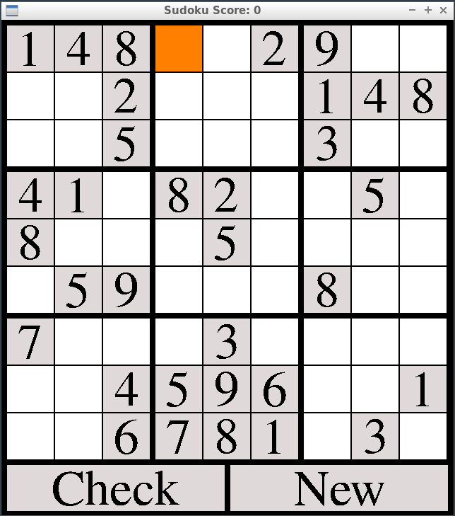

# CPPND: Capstone Snake Game Example

This is the repo for the Capstone project in the [Udacity C++ Nanodegree Program](https://www.udacity.com/course/c-plus-plus-nanodegree--nd213).

My project is an implementation for the famous game Sudoku using the SDL library. The interface of the game looks like the following :

The player has a board of numbers ranging from 1 to 9 spread over the grid with respect to the game principle : each number should be uniquely represented in its colomn, in its row and 3x3 box that he belongs to. The player then must solve the grid and fill in all the missing cells. Movement from one cell to the other is done through the arrow keys, numbers are entered through the numerical keyboard and validation is done throught the check button. The new button generates a new grid.

## Ressources

The references I used for the development of the project were the [SDL Wiki](https://wiki.libsdl.org/), as well as the code of [this](https://github.com/SirFourier/Sudoku-game-using-SDL2) Github Repo as an inspiration.

## Dependencies for Running Locally
* cmake >= 3.7
  * All OSes: [click here for installation instructions](https://cmake.org/install/)
* make >= 4.1 (Linux, Mac), 3.81 (Windows)
  * Linux: make is installed by default on most Linux distros
  * Mac: [install Xcode command line tools to get make](https://developer.apple.com/xcode/features/)
  * Windows: [Click here for installation instructions](http://gnuwin32.sourceforge.net/packages/make.htm)
* SDL2_ttf  >= 2.0
   * Linux : apt-get install -y libsdl2-ttf-dev
   * Windows : SDL2_ttf-devel-2.0.15-VC.zip (Visual C++ 32/64-bit)
               SDL2_ttf-devel-2.0.15-mingw.tar.gz (MinGW 32/64-bit)
   * Mac OS X : SDL2_ttf-2.0.15.dmg 
* gcc/g++ >= 5.4
  * Linux: gcc / g++ is installed by default on most Linux distros
  * Mac: same deal as make - [install Xcode command line tools](https://developer.apple.com/xcode/features/)
  * Windows: recommend using [MinGW](http://www.mingw.org/)

The only addition to the current Udacity workspace would be the instalation of the package libsdl2-ttf-dev.

## Basic Build Instructions

1. Clone this repo.
2. Make a build directory in the top level directory: `mkdir build && cd build`
3. Compile: `cmake .. && make`
4. Run it: `./SudokuGame`.

The program was originally created for Linux, in a 64 bit machine therefore it is configured to run in that. I have never tested it on Windows or Mac.
The #include "SDL2/SDL.h" and #include "SDL2/SDL_ttf.h" only works for Linux. You should remove the "SDL2/" part if you are running in other operating systems.

## Program Instructions

* Arrow keys (Up, Down, Right, Left) are the navigation keys from one cell of the grid to the other.
* Keys 1, 2, 3, 4, 5, 6, 7, 8, 9 (numeric keyboard deactivated): change the content of the empty/editable cell to the input number. Value 0 is not accepted
* Key "BACKSPACE" : Empty the content of the grid cell if it is an editable cell (not generated)
* Key "ENTER" : 
     * applied to the cell "check" : outputs the result of the currently displayed grid
     * applied to the cell "new" : generates a new grid

The score of the game increases each time the grid is correctly solved.    

## File Structure

### main.cpp 

This is the entrypoint for the program. The main function in this file sets variables such as the window height and width, the grid height and width and the number of cells per column and row for the game. The main also creates the Renderer, Controller, and Game objects, and calls the Game::Run method to start the game loop.

### sudoku.h and sudoku.cpp

These files define the Sudoku class which contains attributes to keep track of the content of the displayed sudoku Grid as well as the solution grid for the current run cycle. Additionally, there are methods to generate the solution grid that would be the base for the displayed grid, method to update the content of the displayed grid according to the user requests through the Game::update method.

The sudoku Grid is composed of Sudoku cells arranged in a two dimentional vector. The index in the vector represent their position on the displayed grid. Each sudoku cell has a set of properties that would be used for the display to determine if the cell is editable for example, as well as for the validation of the inputs to the cell.

Apart from the sudoku grid, there exists two buttons on the displayed interface that are check and new. Each of them is represented as a property in the sudoku class that would be reflecting if the user has requested a check of the current grid or a regeneration of the grid.

### game.h and game.cpp

These files define the Game class and the game loop Game::Run. The Game class stores the state of the game, including an instance of a Sudoku object and the game score. Aside from the game loop, the Game class also contains methods to generate the sodoku solution grid, update the state of the game (Game::Update), and set the score of the game.

### render.h and render.cpp

These files define the Renderer class which uses the SDL library to render the game to the screen. The Renderer class constructor creates the SDL window an SDL renderer and an SDL Font object that can draw in the window. The Renderer::Render method draws the layout of the sudoku grid, the control buttons and the currently selected cell in the window using the SDL renderer.

### controller.g and controller.cpp

These files define the Controller class. This class handles keyboard input using the SDL libary, and it sets the cell navigation direction based on the input.

## The addressed rubric points

1- The project demonstrates an understanding of C++ functions and control structures. Covered through all project files.

2- The project accepts user input and processes the input : The project accepts inputs from the user as mentioned in Program Instructions above. The Controller::HandleInput() method handle all the keyboard events mentioned above. Controller.cpp file (line 132).

3- The project uses Object Oriented Programming techniques. The project uses classes Controller, Game, Renderer, Sudoku, SudokuCell. Each class is defined in files of the same name expect for SudokuCell that is defined in the same file as the Sudoku class.

4- Classes use appropriate access specifiers for class members. The project makes use of getters and setters for fetching or modifying the values of private members. Examples of usage are the attributes checkSolution_ and generateNewSudoku_ that are modified through setters within the class Controller (line 109, 111)

5- The project makes use of references in function declarations. Examples of usage class Sudoku (line 185, 169 ...)

6- Class constructors utilize member initialization lists. Example of usage is the constructor of the class Renderer (line 12) 

7- The project uses destructors appropriately. Example of usage is the destructor of the class Renderer (line 29)

8- Classes encapsulate behavior. Example of usage is the member data positionGrid_ part of the class sudoku that is used by member functions and hidden from the user.

